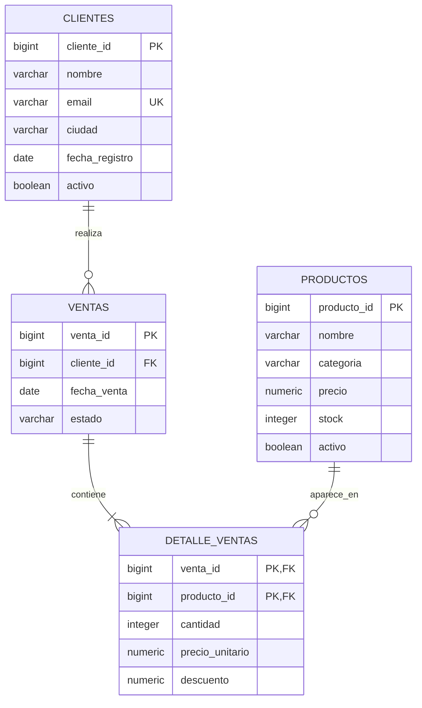

# Diagrama de relaciones



## Lectura rápida

```text
CLIENTES (1) ────────< VENTAS (1) ────────< DETALLE_VENTAS >──────── (1) PRODUCTOS
                         cliente_id              venta_id
                                                  producto_id
```

`DETALLE_VENTAS` funciona como tabla de relación entre `VENTAS` y
`PRODUCTOS`. Su clave primaria compuesta identifica de forma única cada
producto dentro de una venta.